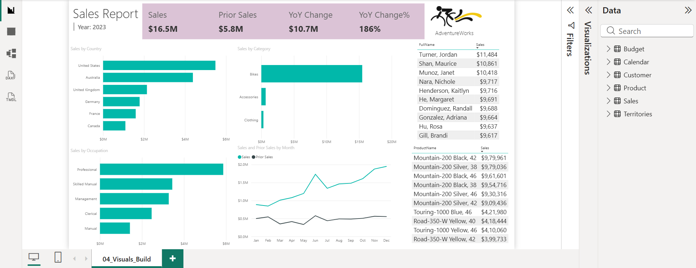

# 📊 Sales Performance Dashboard — Power BI



## 📌 Overview
An interactive sales performance dashboard built in Power BI using the 
AdventureWorks dataset. Analyzes $16.5M in 2023 sales across 6 countries,
3 product categories, and 5 customer segments — with full Year-over-Year
comparison against $5.8M prior year sales.

**Key Result: 186% YoY revenue growth identified ($10.7M increase)**

---

## 📈 Dashboard Highlights

| Metric | Value |
|--------|-------|
| Total Sales (2023) | $16.5M |
| Prior Year Sales | $5.8M |
| YoY Growth | $10.7M (+186%) |
| Top Country | United States |
| Top Category | Bikes (~$18M) |
| Top Customer | Turner, Jordan ($11,484) |
| Top Product | Mountain-200 Black 42 ($9.79M) |

---

## 🖼️ Visuals Included

- **KPI Cards** — Sales, Prior Sales, YoY Change, YoY Change%
- **Sales by Country** — USA, Australia, UK, Germany, France, Canada
- **Sales by Category** — Bikes, Accessories, Clothing
- **Sales by Occupation** — Professional, Skilled Manual, Management,
  Clerical, Manual
- **Sales vs Prior Sales by Month** — Dual line chart (Jan–Dec)
- **Top 10 Customers** — Ranked by revenue contribution
- **Top 10 Products** — Mountain-200 series dominates

---

## 🗃️ Data Model

| Table | Purpose |
|-------|---------|
| Sales | Core transaction data |
| Product | Product hierarchy and categories |
| Customer | Customer demographics and occupation |
| Calendar | Date intelligence for YoY calculations |
| Territories | Geographic sales regions |
| Budget | Target vs actual comparison |

---

## 🛠️ Technical Skills Demonstrated

**Power Query (M Language)**
- Data cleaning and transformation
- Table merging across 6 tables
- Data type standardization

**DAX Measures**
```dax
-- Total Sales
Total Sales = SUM(Sales[SalesAmount])

-- Prior Year Sales
Prior Sales = 
CALCULATE(
    [Total Sales],
    SAMEPERIODLASTYEAR('Calendar'[Date])
)

-- YoY Change
YoY Change = [Total Sales] - [Prior Sales]

-- YoY Change %
YoY Change% = 
DIVIDE([YoY Change], [Prior Sales], 0)
```

**Power BI Features Used**
- Slicers and cross-filtering
- Conditional formatting
- Custom KPI card visuals
- Dual-axis line charts
- Ranked table visuals

---

## 📁 Dataset
- **Source:** AdventureWorks (Microsoft Sample Database)
- **Domain:** Retail / Bicycle Sales
- **Tables:** 6 (Sales, Product, Customer, Calendar, Territories, Budget)
- **Download:** [Microsoft AdventureWorks](https://learn.microsoft.com/en-us/sql/samples/adventureworks-install-configure)

---

## 🚀 How to Open
1. Download `Sales_dashboard.pbix`
2. Open with **Power BI Desktop** 
   (free download: [powerbi.microsoft.com](https://powerbi.microsoft.com))
3. Data is embedded — no external connection needed

---

## 👤 Author
**Suraj Singh** — M.Sc. Data Science & Analytics, Sharda University
[LinkedIn](https://linkedin.com/in/suraj-singh-ds) |
[GitHub](https://github.com/surajthesun1024-ui)
